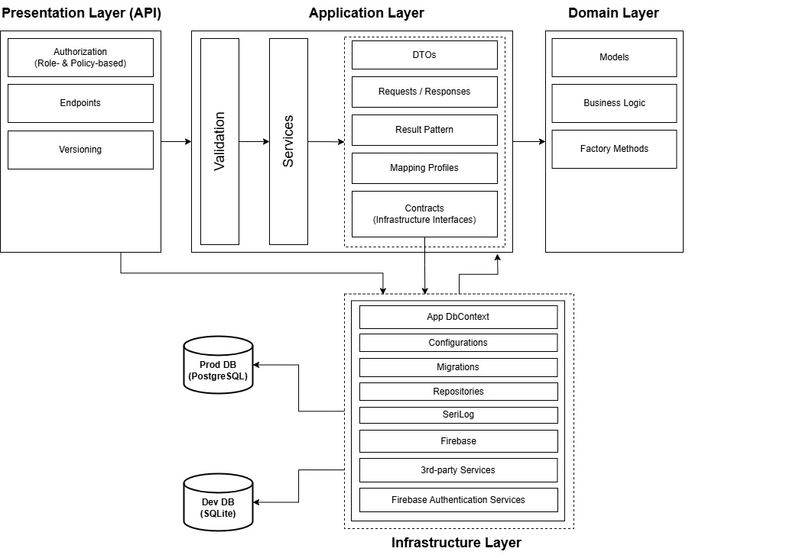

# Sharbo API

Sharbo API is the backend API serving mobile clients of the Sharbo application.
Sharbo is a social media app designed around the idea of preserving inside memes, memorable situations or quotes that only a closed group of people can truly relate to or understand.

Users can create teams (even just two-person ones) and within each team they can assign quotes or memes to specific members. Each entry also stores location data, date and time making it easy to revisit the exact context of the moment.

## Features

- Creating accounts via Firebase including both custom app accounts and third-party providers such as Google or Facebook.
- Modifying account information and changing email address
- Creating groups with multiple roles for participants
- Sharing inside memes, quotes, or memorable moments within private groups
- Membership in multiple groups via one user account
- Notifications about new entry messages and events

## Tech Stack

**Server:** .NET 9.0/C#12, ASP.NET Core Minimal API, Entity Framework Core, Firebase, SignalR, SendGrid, SeriLog, Sieve, FluentValidation, AutoMapper, xUnit, Moq, FluentAssertions, Swagger

**Database:** SQLite, PostgreSQL

## Database

The following image describes the database diagram

## Architecture

The solution follows a Clean Architecture layered approach:

- Domain – models, business logic
- Application – CQRS, application logic, validation, DTOs, requests and responses, Result Pattern
- API – exposes endpoints, authorization rules
- Infrastructure – third-party and database

## Test Coverage

[
)](https://github.com/makaveli404/sharbo-api)

## Authors

- [Andrzej "Andret" Chmiel (andret2344)](https://github.com/andret2344)
- [Mateusz Domagała (makaveli)](https://github.com/makaveli404)
- [Bartłomiej Potoniec (BartTux)](https://github.com/BartTux)

